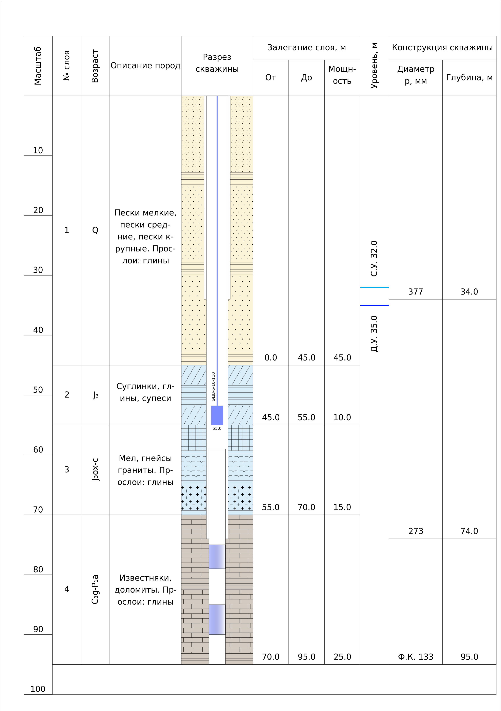
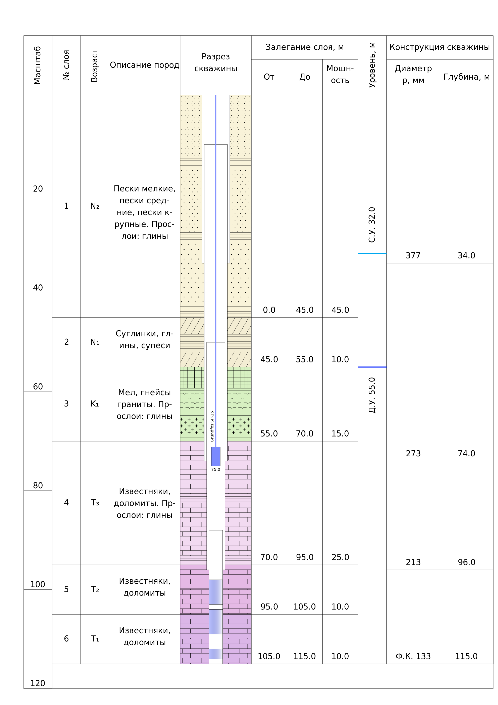

# Well section

Построение вертикального гидрогеологического разреза скважины.

Основной графический модуль расположен в папке **drawing**, шаблон принимаемых данных - **drawing/fixtures.py**.

Расчленение по цветам выполнено на основании общей геохронологической шкалы ВСЕГЕИ [https://vsegei.ru/ru/info/stratigraphy/stratigraphic_scale/]()

Добавленный интервал: четвертичные отложения - девонские отложения (за исключением палеогена).

Отрисовка геологических крапов в соответствии с **ГОСТ Р 21.302-2021**.

Подогнано под формат печати - **А4**.

Пример 1:

Пример 2:

